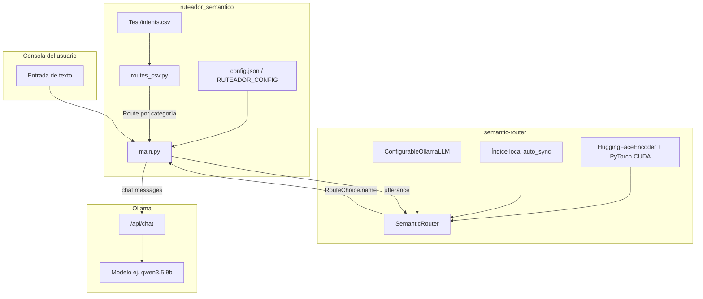

# Ruteador Inten — Chat en consola con Semantic Router + Ollama

Proyecto de demostración que clasifica la intención del usuario con **[semantic-router](https://github.com/aurelio-labs/semantic-router)** (embeddings locales con Hugging Face) y genera la respuesta con **Ollama** y un modelo tipo **Qwen 3.5 9B**. Las rutas del router se generan en tiempo de arranque a partir del CSV de intenciones.

**Entorno por defecto:** Windows con **GPU NVIDIA** y **CUDA** para el encoder PyTorch (`semantic_router.encoder.device`: `"cuda"`). El chat con Ollama usa la GPU que Ollama asigne según su propia configuración y drivers.

## Arquitectura



Flujo resumido:

1. Al iniciar, se lee `config.json`, se resuelve la ruta del CSV y se construyen objetos `Route` (una ruta por categoría, con todas las frases de ejemplo de esa categoría).
2. **SemanticRouter** codifica las frases con el encoder y decide la intención por similitud semántica.
3. El mismo modelo configurado en Ollama recibe un **system prompt** que incluye la intención detectada y responde al usuario en lenguaje natural.

## Estructura del repositorio

| Ruta | Descripción |
|------|-------------|
| `config.json` | Configuración por entorno (modelo, Ollama, CSV, prompts, **device CUDA** del encoder). |
| `requirements.txt` | Dependencias Python; **PyTorch con wheels CUDA 12.4** para Windows + NVIDIA. |
| `install-windows-cuda.ps1` | Script de PowerShell: venv + `pip install -r requirements.txt` + comprobación `torch.cuda`. |
| `ruteador_semantico/` | Código de la aplicación. |
| `ruteador_semantico/main.py` | Arranque, impresión de rutas y bucle de chat. |
| `ruteador_semantico/routes_csv.py` | Generación de `Route` desde el CSV. |
| `ruteador_semantico/ollama_llm.py` | LLM compatible con semantic-router y host configurable. |
| `ruteador_semantico/load_config.py` | Carga de JSON y resolución de rutas relativas. |
| `Test/intents.csv` | Dataset de ejemplo: `id,utterance,category` (sin fila de cabecera). |
| `Doc/` | Notas de contexto (p. ej. `semanticRouter.md`). |

## Dependencias

### Declaradas en `requirements.txt`

| Paquete | Uso |
|---------|-----|
| `torch` (wheel **cu124**) | Backend GPU del encoder vía `--extra-index-url` de PyTorch; evita el wheel solo-CPU por defecto en PyPI. |
| `semantic-router[local]` | Router semántico + encoder Hugging Face local (`transformers`, etc.). |
| `ollama` | Cliente Python para hablar con el servidor Ollama (pull y chat). |
| `requests` | Peticiones HTTP usadas por `ConfigurableOllamaLLM`. |

### Transitivas relevantes

**transformers**, **tokenizers**, etc. La primera ejecución descarga el modelo de embeddings (`semantic_router.encoder.name`, por defecto `sentence-transformers/all-MiniLM-L6-v2`).

**llama-cpp-python** (traído por `semantic-router[local]`): si pip no encuentra un wheel precompilado para tu versión de Python y Windows, intentará **compilar** el paquete; en ese caso hacen falta las herramientas C++ del apartado siguiente.

### Requisitos del sistema (Windows + CUDA)

- **Windows 10/11** (64 bits).
- **Python** 3.10 u 11 recomendado (64 bits, desde [python.org](https://www.python.org/downloads/windows/)).
- **GPU NVIDIA** con drivers recientes; comprobar con `nvidia-smi` en PowerShell.
- **CUDA 12.x** compatible con el wheel usado: el repo apunta a **CUDA 12.4** (`cu124`) en el índice de PyTorch. Si tu driver/stack usa otra variante, cambia la línea `--extra-index-url` en `requirements.txt` según la [matriz oficial de PyTorch](https://pytorch.org/get-started/locally/).
- **[Ollama para Windows](https://ollama.com/download)** con el modelo de `router_model.name`. Ollama usa la GPU NVIDIA automáticamente cuando los drivers lo permiten (comprueba con `nvidia-smi` mientras generas texto).
- **Compilación C++ (recomendado para `pip install`):** instala [Build Tools para Visual Studio](https://visualstudio.microsoft.com/es/visual-cpp-build-tools/) (o Visual Studio completo) con la carga de trabajo **Desarrollo de escritorio con C++** (MSVC, Windows SDK, entorno para `nmake`). Así evitas errores del tipo *`nmake` no encontrado* o *`CMAKE_C_COMPILER not set`* al construir **llama-cpp-python**. Tras instalarlo, ejecuta la instalación de dependencias desde **PowerShell para desarrolladores de VS** o **Símbolo del sistema de herramientas nativas x64**, o asegúrate de que el PATH incluya el kit de compilación, para que CMake encuentre el compilador.

## Instalación (Windows + NVIDIA CUDA)

1. Clonar o copiar el repositorio y abrir **PowerShell** en la raíz del proyecto (si compilaste dependencias nativas, usa **PowerShell para desarrolladores** según el requisito anterior).

2. Instalación asistida (recomendado): crea `.venv`, instala dependencias y verifica `torch.cuda.is_available()`:

   ```powershell
   Set-ExecutionPolicy -Scope CurrentUser RemoteSigned -Force
   .\install-windows-cuda.ps1
   .\.venv\Scripts\Activate.ps1
   ```

3. **Instalación manual** (equivalente al script):

   ```powershell
   python -m venv .venv
   .\.venv\Scripts\Activate.ps1
   python -m pip install --upgrade pip
   pip install -r requirements.txt
   python -c "import torch; print(torch.__version__, torch.cuda.is_available(), torch.cuda.get_device_name(0) if torch.cuda.is_available() else '')"
   ```

4. Instalar y arrancar **Ollama**. Comprobar API en `ollama.host` del `config.json` (por defecto `http://127.0.0.1:11434`).

5. Descargar el modelo de chat:

   ```powershell
   ollama pull qwen3.5:9b
   ```

   El nombre debe coincidir con `router_model.name` en `config.json`.

### Solo CPU en este mismo repo

Si necesitas ejecutar sin GPU, en `config.json` pon `"device": "cpu"` bajo `semantic_router.encoder` y sustituye `requirements.txt` por una instalación estándar sin `--extra-index-url` (por ejemplo solo `pip install torch --index-url https://download.pytorch.org/whl/cpu` más el resto de paquetes), o instala `torch` CPU desde la documentación de PyTorch.

## Configuración (`config.json`)

Todas las variables que suelen cambiar entre entornos conviven en un solo archivo en la raíz. Las rutas relativas (p. ej. `intents_csv`) se resuelven **respecto al directorio donde está el `config.json`**.

| Clave | Descripción |
|-------|-------------|
| `branch` | Etiqueta de rama o despliegue (solo metadato; se muestra al listar rutas). |
| `environment` | Nombre del entorno (por defecto `windows-cuda`). |
| `intents_csv` | Ruta al CSV de intenciones (relativa al `config.json` o absoluta). |
| `ollama.host` | URL base del API de Ollama (sin barra final recomendable). |
| `ollama.pull_on_startup` | Si es `true`, intenta `pull` del modelo al arrancar. |
| `ollama.chat_timeout_seconds` | Timeout HTTP para el LLM del router y referencia de tiempos largos. |
| `router_model.name` | Nombre del modelo en Ollama (chat y, si aplica, uso del LLM en el router). |
| `router_model.temperature` | Temperatura para chat (y coherente con el wrapper del router). |
| `router_model.max_tokens` | Límite de tokens generados (`num_predict` en Ollama). |
| `semantic_router.encoder.name` | Modelo Hugging Face para embeddings. |
| `semantic_router.encoder.device` | Por defecto **`"cuda"`** (GPU NVIDIA). Usa `"cpu"` si no hay CUDA o para depuración. |
| `semantic_router.encoder.score_threshold` | Umbral del encoder (semantic-router). |
| `semantic_router.auto_sync` | Modo de índice local (p. ej. `"local"`). |
| `semantic_router.top_k` | Top-K del router. |
| `semantic_router.aggregation` | Estrategia de agregación (p. ej. `"mean"`). |
| `chat.system_prompt` | Prompt de sistema; debe incluir el placeholder `{route_name}`. |
| `chat.exit_commands` | Palabras para salir del bucle (comparación sin distinguir mayúsculas). |

### Otro archivo de configuración

- Variable de entorno **`RUTEADOR_CONFIG`**: ruta absoluta o relativa a otro `config.json`.
- Línea de comandos: `python -m ruteador_semantico --config ruta\al\config.json`.

## Formato del CSV de intenciones

- **Sin fila de cabecera.**
- Columnas: `id`, `utterance`, `category` (separador coma; la frase puede ir entre comillas si lleva comas).
- Se agrupan todas las filas por `category` y cada categoría se convierte en una **`Route`** con `name = category` y `utterances` = lista de frases no vacías.

## Ejecución

Desde la raíz del proyecto (donde existe la carpeta `ruteador_semantico`):

```powershell
python -m ruteador_semantico
```

Con configuración explícita:

```powershell
python -m ruteador_semantico --config D:\Dev\Ruteador Inten\config.json
```

Al arrancar se imprime la ruta del `config.json` cargado, una línea con **PyTorch CUDA** si la GPU está visible, y un **listado de todas las rutas generadas** con sus ejemplos. Si el config pide CUDA y PyTorch no detecta GPU, verás una **advertencia** en consola. Luego el chat: escribes mensajes; el programa muestra la intención detectada y la respuesta del modelo. Para salir, usa una de las cadenas en `chat.exit_commands` (p. ej. `salir`).

## Documentación adicional

- `Doc/semanticRouter.md` — referencia rápida de semantic-router con Ollama.
- Repositorio upstream: [aurelio-labs/semantic-router](https://github.com/aurelio-labs/semantic-router).

## Nota sobre el host de Ollama

La clase `ConfigurableOllamaLLM` en este proyecto envía las peticiones del LLM del router a la URL definida en `ollama.host`. El cliente de chat usa la misma base vía `OLLAMA_HOST` / `ollama.Client(host=...)`. Si Ollama corre en otra máquina o en Docker, ajusta `ollama.host` y la conectividad de red en consecuencia.
